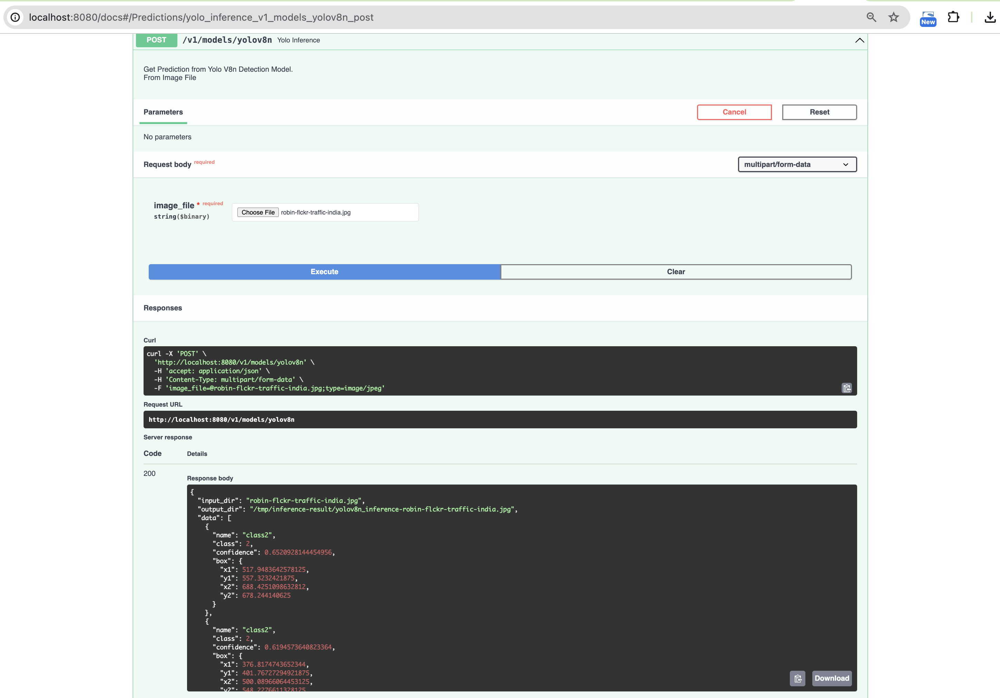

# YoloV8n Deployment With FastAPI and Nvidia Triton Client

On this repo I'll create docker image ready for deployment in any VM Instance and even Kubernetes Cluster.

## Prerequisites
- Docker
- Python 3 or later
- Nvidia GPU Device(for GPU deployment env - Need to install GPU graphics drivers, CUDA, CuDNN, TensorRT(Optional), and Nvidia GPU Container for local or VM Instance)
- Nvidia Triton Inference Server (Docker Image)

## Triton Container Image
For the Triton Container Image, I usually call it as `model-registry`, the `model-registry`  are container pretrained AI/ML model that supported by Triton(for detail model/ramework list <a href="https://docs.nvidia.com/deeplearning/triton-inference-server/user-guide/docs/index.html">refer to here</a>). 

Why I choose Nvidia Triton Inference Server rather than load the pretrained model file inside the FastAPI :

1. Support multiple AI/ML Model and Framework
2. Support <a href='https://docs.nvidia.com/deeplearning/triton-inference-server/user-guide/docs/user_guide/model_configuration.html#dynamic-batcher'>Dynamic Batching</a>
3. Support GPU sharing resource (**Very Important if you want to deploy the AI/ML Model at Scale on Kubernetes Cluster while maintain the cost**)
4. Remote Model Repository
5. GPU Configuration and optimization for Inference
6. Model Analyzer
7. Support for Edge deployment(Nvidia Jetson and Jetpack) device

### Run the Ttiton Inference Server Container
*Notes : *
> To build the Triton Server container, all you need are ready on directory `triton-model-server`

- Run The Triton container image already created before
    ```
    yogiwahyuromadon@ADMINs-Air-3 triton-model-server % docker run --name triton-model-server -d -p 8000:8000 -p 8001:8001 -p 8002:8002 triton-inference-server-model:latest
    be7bb7ea6acfbe69215e599d76f7dcccb247637dc6c1f060a6c105ed1c88d54a
    yogiwahyuromadon@ADMINs-Air-3 triton-model-server %
    ```

    Check the container runner :
    ```
    yogiwahyuromadon@ADMINs-Air-3 triton-model-server % docker ps               
    CONTAINER ID   IMAGE                                  COMMAND                  CREATED          STATUS          PORTS                              NAMES
    be7bb7ea6acf   triton-inference-server-model:latest   "tritonserver --mode…"   39 seconds ago   Up 39 seconds   0.0.0.0:8000-8002->8000-8002/tcp   triton-model-server
    ```
    Check The log : 
    ```
    yogiwahyuromadon@ADMINs-Air-3 triton-model-server % docker logs triton-model-server  
    W0317 04:01:07.611309 1 pinned_memory_manager.cc:237] Unable to allocate pinned system memory, pinned memory pool will not be available: CUDA driver version is insufficient for CUDA runtime version
    I0317 04:01:07.611388 1 cuda_memory_manager.cc:117] CUDA memory pool disabled
    E0317 04:01:07.611474 1 server.cc:243] CudaDriverHelper has not been initialized.
    I0317 04:01:07.612455 1 model_lifecycle.cc:461] loading: yolov8n:1
    I0317 04:01:07.615959 1 onnxruntime.cc:2608] TRITONBACKEND_Initialize: onnxruntime
    I0317 04:01:07.615997 1 onnxruntime.cc:2618] Triton TRITONBACKEND API version: 1.17
    I0317 04:01:07.616001 1 onnxruntime.cc:2624] 'onnxruntime' TRITONBACKEND API version: 1.17
    I0317 04:01:07.616004 1 onnxruntime.cc:2654] backend configuration:
    {"cmdline":{"auto-complete-config":"true","backend-directory":"/opt/tritonserver/backends","min-compute-capability":"6.000000","default-max-batch-size":"4"}}
    I0317 04:01:07.631661 1 onnxruntime.cc:2719] TRITONBACKEND_ModelInitialize: yolov8n (version 1)
    I0317 04:01:07.703179 1 onnxruntime.cc:2784] TRITONBACKEND_ModelInstanceInitialize: yolov8n_1 (CPU device 0)
    I0317 04:01:07.703213 1 onnxruntime.cc:2784] TRITONBACKEND_ModelInstanceInitialize: yolov8n_0 (CPU device 0)
    I0317 04:01:07.782778 1 model_lifecycle.cc:818] successfully loaded 'yolov8n'
    I0317 04:01:07.782927 1 server.cc:606] 
    +------------------+------+
    | Repository Agent | Path |
    +------------------+------+
    +------------------+------+

    I0317 04:01:07.782976 1 server.cc:633] 
    +-------------+-----------------------------------------------------------------+---------------------------------------------------------------------------------------------------------------------------------------------------------------+
    | Backend     | Path                                                            | Config                                                                                                                                                        |
    +-------------+-----------------------------------------------------------------+---------------------------------------------------------------------------------------------------------------------------------------------------------------+
    | onnxruntime | /opt/tritonserver/backends/onnxruntime/libtriton_onnxruntime.so | {"cmdline":{"auto-complete-config":"true","backend-directory":"/opt/tritonserver/backends","min-compute-capability":"6.000000","default-max-batch-size":"4"}} |
    +-------------+-----------------------------------------------------------------+---------------------------------------------------------------------------------------------------------------------------------------------------------------+

    I0317 04:01:07.783006 1 server.cc:676] 
    +---------+---------+--------+
    | Model   | Version | Status |
    +---------+---------+--------+
    | yolov8n | 1       | READY  |
    +---------+---------+--------+

    Error: Failed to initialize NVML
    W0317 04:01:07.785901 1 metrics.cc:738] DCGM unable to start: DCGM initialization error
    I0317 04:01:07.786033 1 metrics.cc:710] Collecting CPU metrics
    I0317 04:01:07.786117 1 tritonserver.cc:2483] 
    +----------------------------------+-----------------------------------------------------------------------------------------------------------------------------------------------------------------------------------------------------------------+
    | Option                           | Value                                                                                                                                                                                                           |
    +----------------------------------+-----------------------------------------------------------------------------------------------------------------------------------------------------------------------------------------------------------------+
    | server_id                        | triton                                                                                                                                                                                                          |
    | server_version                   | 2.41.0                                                                                                                                                                                                          |
    | server_extensions                | classification sequence model_repository model_repository(unload_dependents) schedule_policy model_configuration system_shared_memory cuda_shared_memory binary_tensor_data parameters statistics trace logging |
    | model_repository_path[0]         | /model-registry                                                                                                                                                                                                 |
    | model_control_mode               | MODE_NONE                                                                                                                                                                                                       |
    | strict_model_config              | 0                                                                                                                                                                                                               |
    | rate_limit                       | OFF                                                                                                                                                                                                             |
    | pinned_memory_pool_byte_size     | 268435456                                                                                                                                                                                                       |
    | min_supported_compute_capability | 6.0                                                                                                                                                                                                             |
    | strict_readiness                 | 1                                                                                                                                                                                                               |
    | exit_timeout                     | 30                                                                                                                                                                                                              |
    | cache_enabled                    | 0                                                                                                                                                                                                               |
    +----------------------------------+-----------------------------------------------------------------------------------------------------------------------------------------------------------------------------------------------------------------+

    I0317 04:01:07.789010 1 grpc_server.cc:2495] Started GRPCInferenceService at 0.0.0.0:8001
    I0317 04:01:07.789197 1 http_server.cc:4619] Started HTTPService at 0.0.0.0:8000
    I0317 04:01:07.837507 1 http_server.cc:282] Started Metrics Service at 0.0.0.0:8002
    ```

- Triton Model Server are ready.

### Run the FastAPI Client Server Container
*Notes : *
> To build the FastAPI Client Server container, all you need are ready on directory `fastapi-triton-client`

- Run The FastAPI Container
    ```
    docker run -d --link triton-model-server:triton-model-server -e TRITON_ENDPOINT='triton-model-server' -e PORT='8000' -e MODEL_NAME='yolov8n' -e MODEL_VERSION='1' -p 8080:80 fastapi-ml-client-yolo:latest
    ```
    Check the contauner runner :
    ```
    yogiwahyuromadon@ADMINs-Air-3 triton-model-server % docker run -d --link triton-model-server:triton-model-server -e TRITON_ENDPOINT='triton-model-server' -e PORT='8000' -e MODEL_NAME='yolov8n' -e MODEL_VERSION='1' -p 8080:80 fastapi-ml-client-yolo:latest
    97dfd20c40fad560d91ffe3494fb74e6945c8564ab7dc96ea03bfce1ab44fee2
    yogiwahyuromadon@ADMINs-Air-3 triton-model-server % docker ps
    CONTAINER ID   IMAGE                                  COMMAND                  CREATED         STATUS         PORTS                              NAMES
    97dfd20c40fa   fastapi-ml-client-yolo:latest          "uvicorn app.api:app…"   6 seconds ago   Up 5 seconds   0.0.0.0:8080->80/tcp               epic_lamport
    ```

- Now the FastAPI Server for YoloV8n are ready to inference, open the `http:localhost:8080/docs` to view the swagger/openapi.
- Sample Inference : 

    </img>


### Demo Video

GDrive Video Link
    https://drive.google.com/file/d/1uC4SwnHhFJrsXNGKuucfBMDc5Emh9dXn/view?usp=sharing