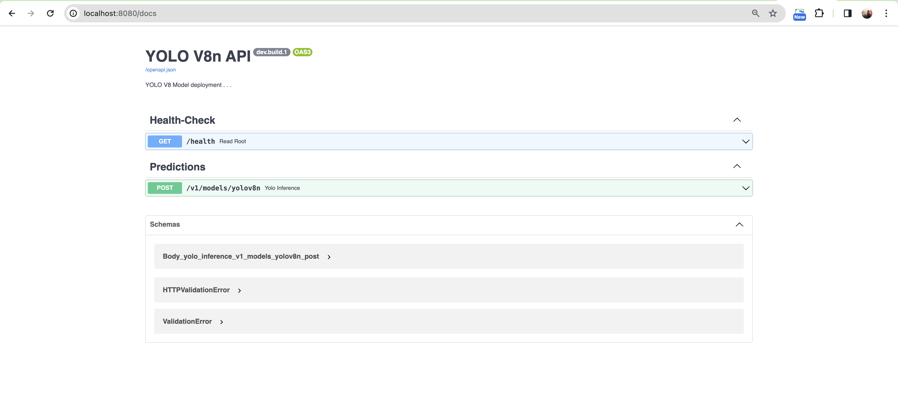
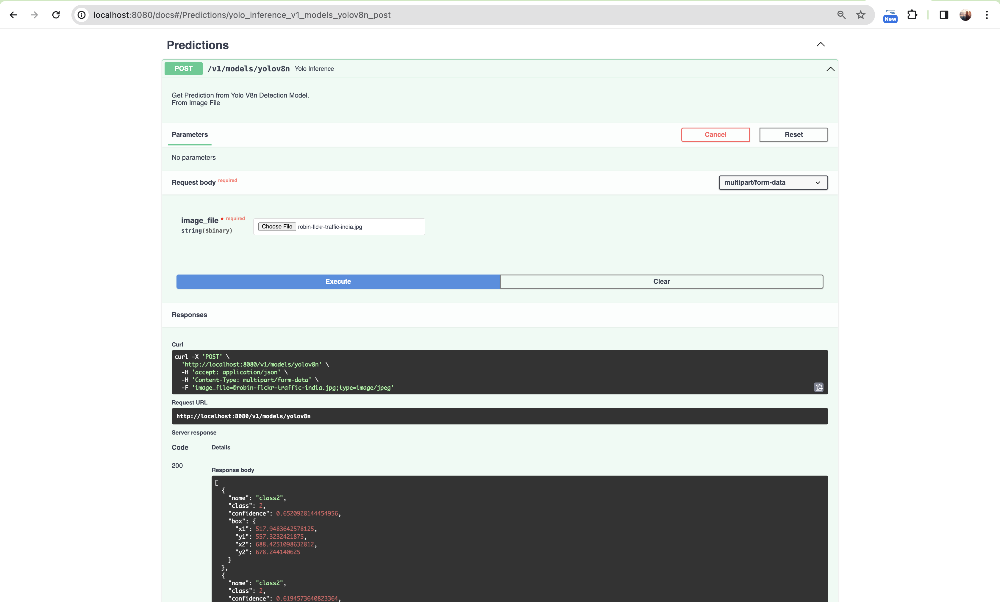

# Api Deployment ML Client with FastAPI

This directory contain rest API deployment container with FastAPI

## Create Docker FastAPI ML Client
Steps : 

1. Dockerize FastAPI ML Client

    `docker build -t IMAGE_NAME:TAG .`
    ```
    docker build -t fastapi-ml-client-yolo:latest .
    ```
2. Check the docker image after build process
    ```
    yogiwahyuromadon@ADMINs-Air-3 fastapi-triton-client % docker images | grep fastapi
    fastapi-ml-client-yolo          latest      e22f9a4b093a   13 seconds ago   1.81GB
    yogiwahyuromadon@ADMINs-Air-3 fastapi-triton-client % 
    ```
3. Test Run the image
    **Notes :**

    To run this docker image we need to specify `--link` params, because we need to connect from FastAPI ML  Client Container to Container Triton Server that already running before, and specify the env variable `TRITON_ENDPOINT` with triton container name.
    
    ```
    yogiwahyuromadon@ADMINs-Air-3 fastapi-triton-client % docker ps
    CONTAINER ID   IMAGE                                  COMMAND                  CREATED        STATUS        PORTS                              NAMES
    55aa74d3ebbd   triton-inference-server-model:latest   "tritonserver --mode…"   12 hours ago   Up 12 hours   0.0.0.0:8000-8002->8000-8002/tcp   triton-model-server
    ```

    ```
    docker run -d --link triton-model-server:triton-model-server -e TRITON_ENDPOINT='triton-model-server' -e PORT='8000' -e MODEL_NAME='yolov8n' -e MODEL_VERSION='1' -p 8080:80 fastapi-ml-client-yolo:latest
    ```

    If the docker successfully runniing the container logs will shows like :
    ```
    yogiwahyuromadon@ADMINs-Air-3 fastapi-triton-client % docker run -d --link triton-model-server:triton-model-server -e TRITON_ENDPOINT='triton-model-server' -e PORT='8000' -e MODEL_NAME='yolov8n' -e MODEL_VERSION='1' -p 8080:80 fastapi-ml-client-yolo:latest
    66d1a959659b90006df649d5fbf4b75e2e3e67a398795995cfc83223d0399083
    yogiwahyuromadon@ADMINs-Air-3 fastapi-triton-client % docker ps
    CONTAINER ID   IMAGE                                  COMMAND                  CREATED         STATUS         PORTS                              NAMES
    66d1a959659b   fastapi-ml-client-yolo:latest          "uvicorn app.api:app…"   9 seconds ago   Up 7 seconds   0.0.0.0:8080->80/tcp               kind_goodall
    55aa74d3ebbd   triton-inference-server-model:latest   "tritonserver --mode…"   12 hours ago    Up 12 hours    0.0.0.0:8000-8002->8000-8002/tcp   elated_shockley
    yogiwahyuromadon@ADMINs-Air-3 fastapi-triton-client % docker logs kind_goodall
    INFO:     Uvicorn running on http://0.0.0.0:80 (Press CTRL+C to quit)
    INFO:     Started parent process [1]
    2024-03-17 03:08:13.000 | INFO     | asyncio.runners:run:44 - Started server process [9]
    2024-03-17 03:08:13.000 | INFO     | asyncio.runners:run:44 - Started server process [9]
    2024-03-17 03:08:13.065 | INFO     | asyncio.runners:run:44 - Started server process [8]
    2024-03-17 03:08:13.065 | INFO     | asyncio.runners:run:44 - Started server process [8]
    ```
4. Open new tab on your browser, and should shown like this:

    </img>

5. To check the healthcheck deployment, just hit the API path `/health` if the return code is `200`, all safe. and the return code is `500` there is something wrong in the API

6. To make inference, you need to hit the API path `/v1/models/yolov8n`, like this :

    </img>
